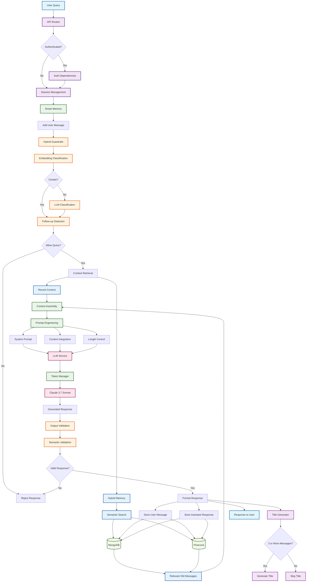

# EarthGPT Backend

A sophisticated sustainability-focused AI assistant backend built with FastAPI, featuring advanced guardrails, hybrid memory management, and intelligent conversation handling.

## Architecture Overview

EarthGPT Backend is designed as a modular, scalable system that combines multiple AI models and advanced memory management to provide intelligent sustainability-focused conversations while maintaining strict content filtering and context awareness.

### Core Components
- **FastAPI Application**: RESTful API with authentication
- **Hybrid Guardrail System**: Multi-layer content filtering using embeddings + LLM
- **Hybrid Memory Management**: MongoDB + Pinecone for persistent semantic search
- **Smart Context Management**: Intelligent conversation history and token optimization
- **Multi-Model LLM Integration**: Claude 3.7 Sonnet (main) + Claude 3.5 Haiku (classification/summarization)

## 📁 Directory Structure

```
backend/
├── api/                    # API endpoints and routing
│   ├── routes.py          # Main chat endpoints
│   └── auth_routes.py     # Authentication endpoints
├── auth/                   # Authentication and authorization
│   └── dependencies.py    # Auth dependencies and middleware
├── core/                   # Core business logic and services
│   ├── smart_memory.py    # Session memory and context management
│   ├── hybrid_memory.py   # Persistent storage (MongoDB + Pinecone)
│   ├── prompt_engineering.py # Prompt construction and optimization
│   ├── classification_llm.py # LLM service for classification (Claude 3.5 Haiku)
│   ├── summarization_llm.py # LLM service for summarization (Claude 3.5 Haiku)
│   ├── title_generator.py # Conversation title generation
│   └── token_manager.py   # Token counting and context window management
├── database/               # Database connections and configuration
│   └── mongodb.py         # MongoDB connection manager
├── guardrails/             # Content filtering and validation
│   ├── __init__.py        # Guardrails module exports
│   ├── base.py            # Base guardrails class
│   ├── models.py          # Guardrail data models
│   ├── hybrid_classifier_guardrails.py # Main guardrail system
│   └── intelligent_output_validator.py # Response validation
├── models/                 # Data models and schemas
│   ├── schemas.py         # Pydantic models for API
│   └── user.py            # User and session models
├── services/               # External service integrations
│   └── llm_service.py     # Main LLM service (Claude 3.7 Sonnet)
├── logs/                   # Application logs
├── config.py              # Application configuration
├── main.py                # FastAPI application entry point
├── requirements.txt       # Python dependencies
└── README.md             # This file
```

## Core Files Explained

### Configuration & Entry Point

#### `config.py`
**Purpose**: Central configuration management using Pydantic BaseSettings
**Key Settings**:
- Database connections (MongoDB, Pinecone)
- LLM model configurations (Claude 3.7 Sonnet, Claude 3.5 Haiku)
- API keys and environment variables
- Token limits and optimization parameters

#### `main.py`
**Purpose**: FastAPI application entry point and middleware setup
**Features**:
- CORS configuration
- Request/response logging
- Health check endpoints
- Application lifecycle management

### API Layer (`api/`)

#### `api/routes.py`
**Purpose**: Main API endpoints for chat functionality
**Key Endpoints**:
- `POST /api/v1/chat` - Anonymous chat
- `POST /api/v1/chat/authenticated` - Authenticated chat
- `GET /api/v1/health` - Health check

**Flow**:
1. **Input Validation**: Validates incoming chat requests using Pydantic models
2. **Session Management**: Creates or retrieves conversation sessions via MongoDB
3. **Guardrail Check**: Validates sustainability relevance using hybrid classifier
4. **Context Retrieval**: Gets optimized conversation context with semantic search
5. **LLM Generation**: Generates response using Claude 3.7 Sonnet
6. **Output Validation**: Validates response content and relevance
7. **Memory Storage**: Stores conversation in hybrid memory system (MongoDB + Pinecone)
8. **Title Generation**: Generates conversation titles for long sessions

#### `api/auth_routes.py`
**Purpose**: Authentication and user management endpoints
**Features**:
- User registration and login
- JWT token management
- User session handling

### Authentication (`auth/`)

#### `auth/dependencies.py`
**Purpose**: Authentication and authorization dependencies
**Features**:
- JWT token validation
- User session management
- Role-based access control
- Security middleware integration

### Core Business Logic (`core/`)

#### `core/smart_memory.py`
**Purpose**: Session-based memory management and context optimization
**Key Features**:
- **Session Management**: Tracks active conversation sessions in memory
- **Token Optimization**: Manages context window limits and message truncation
- **Context Assembly**: Combines recent messages with relevant historical context
- **Memory Integration**: Interfaces with hybrid memory for persistent storage

**Flow**:
1. **Message Storage**: Stores user/assistant messages in session memory
2. **Context Optimization**: Limits recent messages to prevent context pollution (max 6 messages)
3. **Semantic Search**: Retrieves relevant old messages via hybrid memory
4. **Context Assembly**: Combines recent + relevant historical context for LLM

#### `core/hybrid_memory.py`
**Purpose**: Persistent memory storage using MongoDB + Pinecone
**Architecture**:
- **MongoDB**: Stores full message content, metadata, and relationships
- **Pinecone**: Stores vector embeddings for semantic search
- **Hybrid Storage**: Combines both for comprehensive memory management

**Key Methods**:
- `store_message()`: Stores messages in both MongoDB and Pinecone
- `search_similar_messages()`: Performs semantic search across conversation history
- `get_conversation_history()`: Retrieves chronological message history

### 🧠 Memory System Architecture

#### **Why Two Memory Systems?**

**Smart Memory** (`core/smart_memory.py`) - **Active Session Manager**
- **Purpose**: Manages current conversation sessions and context optimization
- **Storage**: In-memory (temporary, session-based)
- **Focus**: Fast session operations, context assembly, token optimization
- **Lifecycle**: Data exists only during active session

**Hybrid Memory** (`core/hybrid_memory.py`) - **Persistent Knowledge Base**
- **Purpose**: Provides persistent storage and semantic search across all conversations
- **Storage**: MongoDB + Pinecone (permanent, cross-session)
- **Focus**: Long-term memory, semantic search, cross-session knowledge
- **Lifecycle**: Data persists forever for comprehensive memory

#### **How They Work Together**
```
1. User sends message
   ↓
2. Smart Memory: Adds to current session (fast, temporary)
   ↓
3. Hybrid Memory: Stores permanently (MongoDB + Pinecone)
   ↓
4. Smart Memory: Retrieves context (recent + semantic search)
   ↓
5. Smart Memory: Builds optimized prompt for LLM
   ↓
6. LLM generates response
   ↓
7. Smart Memory: Adds response to session
   ↓
8. Hybrid Memory: Stores response permanently
```

#### **Example: "Do you remember about the rebound effect?"**
```python
# Smart Memory: Gets current session context
current_session = smart_memory.get_session_messages(session_id)

# Hybrid Memory: Searches ALL conversations for "rebound effect"
old_messages = hybrid_memory.search_similar_messages(
    query="rebound effect",
    user_id=user_id,
    session_id=session_id  # Excludes current session
)

# Smart Memory: Combines and optimizes context
optimized_context = smart_memory.build_context(
    recent=current_session,      # Last 6 messages
    relevant=old_messages        # Relevant old messages
)
```

#### `core/prompt_engineering.py`
**Purpose**: Intelligent prompt construction and optimization
**Features**:
- **System Prompt Management**: Maintains EarthGPT's sustainability-focused persona
- **Context Integration**: Incorporates relevant historical context from semantic search
- **Length Control**: Detects user intent for response length ("in short", "detailed")
- **Token Management**: Optimizes prompt length within model limits

#### `core/classification_llm.py`
**Purpose**: Dedicated LLM service for sustainability classification using Claude 3.5 Haiku
**Features**:
- **Fast Classification**: Optimized for quick YES/NO sustainability relevance decisions
- **Cost-Effective**: Uses Haiku model for classification tasks
- **Deterministic**: Low temperature (0.0) for consistent results
- **Follow-up Detection**: Uses LLM for ambiguous follow-up question detection

#### `core/summarization_llm.py`
**Purpose**: LLM service for conversation summarization using Claude 3.5 Haiku
**Features**:
- **Conversation Summarization**: Creates concise summaries of long conversations
- **Context Compression**: Reduces token usage while preserving key information
- **Incremental Updates**: Updates summaries as conversations progress

#### `core/title_generator.py`
**Purpose**: Generates conversation titles for long chat sessions
**Features**:
- **Automatic Title Generation**: Creates descriptive titles after 3+ messages
- **Context-Aware**: Uses conversation content to generate relevant titles
- **User-Friendly**: Helps users identify and manage conversations

#### `core/token_manager.py`
**Purpose**: Token counting and context window management
**Features**:
- **Token Counting**: Accurate token estimation for different models
- **Context Window Management**: Optimizes context within model limits
- **Message Truncation**: Intelligently truncates messages when needed

### Guardrails (`guardrails/`)

#### `guardrails/hybrid_classifier_guardrails.py`
**Purpose**: Advanced multi-layer content filtering system
**Architecture**:
1. **Layer 1 - Embedding Classification**: Fast semantic similarity against sustainability categories using SentenceTransformer
2. **Layer 2 - LLM Classification**: Claude 3.5 Haiku fallback for uncertain cases
3. **Layer 3 - Follow-up Detection**: Two-layer system (pattern-based + LLM-based) for conversation continuity
4. **Layer 4 - Output Validation**: Intelligent response validation using semantic similarity

**Key Features**:
- **Hybrid Approach**: Combines speed of embeddings with accuracy of LLM
- **Two-Layer Follow-up Detection**: Pattern-based + LLM-based for conversation continuity
- **Intelligent Output Validation**: Semantic similarity + context-aware thresholds
- **Sustainability Categories**: Comprehensive environmental and sustainability topic coverage
- **Multi-Query Search**: Uses multiple search strategies for better old message retrieval

#### `guardrails/intelligent_output_validator.py`
**Purpose**: Advanced response validation using semantic similarity
**Features**:
- **Semantic Validation**: Uses sentence transformers for content similarity
- **Adaptive Thresholds**: Adjusts validation strictness based on input confidence
- **Technical Term Recognition**: Recognizes sustainability-specific terminology
- **Graceful Fallbacks**: Falls back to basic validation if semantic validation fails

#### `guardrails/base.py`
**Purpose**: Base class for all guardrail implementations
**Features**:
- **Abstract Interface**: Defines common guardrail methods
- **Consistent API**: Standardized interface for all guardrail types

#### `guardrails/models.py`
**Purpose**: Data models for guardrail system
**Features**:
- **GuardrailCheck**: Result model for guardrail decisions
- **Type Safety**: Pydantic models for validation

### 🔌 Services (`services/`)

#### `services/llm_service.py`
**Purpose**: Main LLM service integration with Claude 3.7 Sonnet
**Features**:
- **Response Generation**: Primary chat response generation
- **Token Management**: Handles context window limits and optimization
- **Error Handling**: Robust error handling and fallback mechanisms
- **Performance Monitoring**: Tracks response times and token usage

### Database (`database/`)

#### `database/mongodb.py`
**Purpose**: MongoDB connection and database management
**Features**:
- **Async Connection**: Motor-based async MongoDB client
- **Connection Management**: Handles connection lifecycle
- **Index Creation**: Automatic index creation for performance
- **Error Handling**: Robust error handling and logging

### Models (`models/`)

#### `models/schemas.py`
**Purpose**: Pydantic models for API request/response validation
**Key Models**:
- `ConversationRequest`: Input validation for chat messages
- `ConversationResponse`: Response formatting and metadata
- `SessionInfo`: Session management and tracking
- `Message`: Individual message structure
- `User`: User authentication and profile data

#### `models/user.py`
**Purpose**: User and session data models
**Features**:
- **User Management**: User registration and authentication
- **Session Models**: Chat session tracking and management
- **Database Integration**: MongoDB collection definitions

## System Flow

### Complete Backend Architecture Flow



### Detailed Flow Breakdown

#### 1. **Request Processing Flow**
```
User Query → API Route → Authentication Check → Session Management (MongoDB) → Smart Memory
```

#### 2. **Content Filtering Flow**
```
Query → Embedding Classification (SentenceTransformer) → LLM Classification (Claude 3.5 Haiku) → Follow-up Detection (Two-Layer) → Decision
```

#### 3. **Context Management Flow**
```
Query → Recent Context (Smart Memory) → Semantic Search (Multi-Query) → MongoDB + Pinecone → Context Assembly → Prompt Building
```

#### 4. **Response Generation Flow**
```
Optimized Context → Token Management → LLM Generation (Claude 3.7 Sonnet) → Output Validation → Response Formatting → Memory Storage
```

#### 5. **Memory Storage Flow**
```
Message → Hybrid Memory → MongoDB (Full Storage) + Pinecone (Vector Embeddings) → Title Generation (if 3+ messages)
```

### Key System Components

#### **Memory Architecture**
- **Smart Memory**: Session-based, in-memory, manages recent context (last 6 messages)
- **Hybrid Memory**: Persistent storage, MongoDB + Pinecone, cross-session semantic search

#### **Guardrail System**
- **Layer 1**: Embedding classification using SentenceTransformer
- **Layer 2**: LLM classification using Claude 3.5 Haiku for uncertain cases
- **Layer 3**: Two-layer follow-up detection (pattern-based + LLM-based)
- **Layer 4**: Output validation using semantic similarity

#### **LLM Integration**
- **Claude 3.7 Sonnet**: Main response generation
- **Claude 3.5 Haiku**: Classification and summarization tasks
- **Token Management**: Context window optimization and message truncation

#### **Database Systems**
- **MongoDB**: Document storage for messages, sessions, and metadata
- **Pinecone**: Vector database for semantic search and similarity matching

## Key Integrations

### LLM Models
- **Claude 3.7 Sonnet**: Primary chat responses (high-quality, comprehensive)
- **Claude 3.5 Haiku**: Classification and summarization (fast, cost-effective)

### Database Systems
- **MongoDB**: Document storage for messages, sessions, and metadata
- **Pinecone**: Vector database for semantic search and similarity matching

### External Services
- **Anthropic API**: LLM model access and management
- **Sentence Transformers**: Local embedding generation for semantic similarity

## 🔧 Configuration Requirements

### Environment Variables
```bash
# Database
MONGODB_URL=mongodb://localhost:27017
PINECONE_API_KEY=your_pinecone_key

# LLM Services
ANTHROPIC_API_KEY=your_anthropic_key

# Application
SECRET_KEY=your_secret_key
DEBUG=False
ENVIRONMENT=development
```

### Dependencies
- **FastAPI**: Web framework and API routing
- **Pydantic**: Data validation and settings management
- **Motor**: Async MongoDB driver
- **Pinecone**: Vector database client for semantic search
- **Anthropic**: Claude API client for LLM integration
- **Sentence Transformers**: Local embedding generation
- **NumPy**: Numerical computations for similarity calculations
- **Loguru**: Advanced logging system
- **Uvicorn**: ASGI server for FastAPI

## Getting Started

### 1. Installation
```bash
pip install -r requirements.txt
```

### 2. Environment Setup
```bash
cp .env.example .env
# Edit .env with your configuration
```

### 3. Database Setup
```bash
# Ensure MongoDB is running
# Ensure Pinecone index is created
```

### 4. Run Application
```bash
uvicorn main:app --reload --host 0.0.0.0 --port 8000
```

This backend system represents a sophisticated approach to AI-powered sustainability assistance, combining advanced guardrails, intelligent memory management, and multi-model LLM integration to provide accurate, contextual, and reliable responses while maintaining strict content filtering and conversation continuity.
